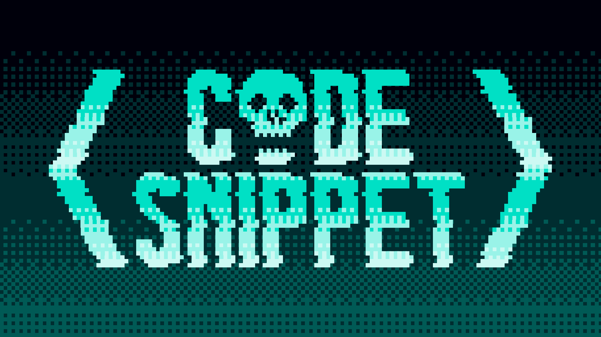

#  Vulnerable Code Snippets



[YesWeHack](https://www.yeswehack.com/) present code snippets containing several different vulnerabilities to practice your code analysis. The code snippets are beginner friendly but suitable for all levels!

~ New **vulnerable code snippet** at Twitter [@yeswehack](https://twitter.com/yeswehack) **every Friday**! 🗒

---

⚠️ **Be aware**
> Be sure to run this in a secure environment, as the code is vulnerable and is intended to be used for learning code analysis!

## Twitter posts 🔖
A Collection of all vulnerable code snippets posted on our Twitter 📂    
📜[#1](https://twitter.com/yeswehack/status/1570757831468679169) - SQLi & XSS | Backslash filter collide  
📜[#2](https://twitter.com/yeswehack/status/1573303741310271490) - Improper file access & XSS | Invalid char and regex verificaion  
📜[#3](https://twitter.com/yeswehack/status/1575839882269818881) - Log Forging injection, Path traversal & Code injection | Poor filter and improper include() handling  
📜[#4](https://twitter.com/yeswehack/status/1578370258230194177) - XSS | Invalid user input filter   
📜[#5](https://twitter.com/yeswehack/status/1580911299382296576) - SSRF & Broken authorization | Trusted user input and client IP from header.  
📜[#6](https://twitter.com/yeswehack/status/1583445497687130114) - SSTI | Mixed input format  
📜[#7](https://twitter.com/yeswehack/status/1585979707522134017) - SQLi | Use of invalid variable within statement  
📜[#8](https://twitter.com/yeswehack/status/1588531516665171969) - CSRF | No CSRF token included  
📜[#9](https://twitter.com/yeswehack/status/1591068243439009798) - Open Redirect | Invalid regex handler  
📜[#10](#) - Coming soon!  

## Vulnerabilities 💀
- [Broken access control](https://owasp.org/www-community/Broken_Access_Control) - CWE-284
- [Code injection](https://owasp.org/www-community/attacks/Code_Injection) - CWE-94
- [Cross Site Request Forgery (CSRF)](https://owasp.org/www-community/attacks/csrf) (CSRF) - CWE-352
- [SQL injection (SQLi)](https://owasp.org/www-community/attacks/SQL_Injection) (SQLi) - CWE-89
- [Cross Site Scripting](https://owasp.org/www-community/attacks/xss/) (XSS) - CWE-79
- [Open Redirect](https://cheatsheetseries.owasp.org/cheatsheets/Unvalidated_Redirects_and_Forwards_Cheat_Sheet.html) - CWE-601
- [Server-side template injection](https://owasp.org/www-project-web-security-testing-guide/v41/4-Web_Application_Security_Testing/07-Input_Validation_Testing/18-Testing_for_Server_Side_Template_Injection) (SSTI) - CWE-1336
- [Server Side Request Forgery](https://owasp.org/www-community/attacks/Server_Side_Request_Forgery) (SSRF)- CWE-918

## Programming Language 💻
- [PHP](https://www.php.net/)
- [Python](https://www.python.org/)
- [Golang](https://go.dev/)
- [JavaScript](https://www.javascript.com/)

__Also included__
- SQL ([MySQL](https://www.mysql.com/))
- HTML
- CSS

---

## Installation 🏁
This will create a new MySQL user and a database for the vulnerable code snippet to use.  

> ⚠️ Replace `'<USERNAME>'` `'<PASSWORD>'` `'<DATABASE>'` to your *new* MySQL **user**, **password** and new vulnerable snippet **Database**. 
```bash
sudo apt update;
cd db/ && ./setupVsnippet.sh '<USERNAME>' '<PASSWORD>' '<DATABASE>';
```
  
For questions, help or if you have discovered a problem with the code. Contact us on Twitter: [@yeswehack](https://twitter.com/yeswehack) 📬
